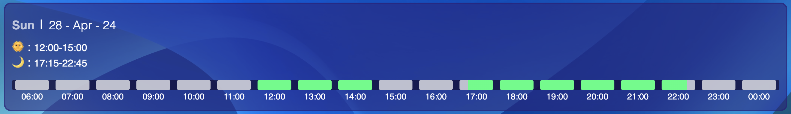

# Overview

Smart Rota is a comprehensive, non-industry-specific rota-management platform designed to streamline time management and enhance communication between management and team members. It addresses common challenges in shift management, such as memory lapses and inaccuracies in shift timings, by empowering employees to request changes to their rotas and enabling managers to approve these requests efficiently.

# Distinctiveness and Complexity

Smart Rota stands out from other projects in the course by providing a specialized solution for workforce management. This project does not replicate the functionality of any prior projects such as Search, Wiki, or Mail, ensuring it meets the distinctiveness criterion set by CS50W.

- **Models and Backend**: While the course requires at least one Django model, Smart Rota incorporates five distinct models and one user manager class, each serving a unique aspect of rota management. This architectural structure supports a robust backend necessary to provide complex business solutions.
- **Frontend Technologies**: The frontend utilizes React coupled with Redux for state management. This setup, particularly the use of Redux for managing authentication states, introduces a level of complexity not required in earlier projects.
- **User Interface**: Special attention has been given to the user interface, with smooth animations and custom-built data visualization components. These elements enhance the overall user experience by providing intuitive and visually engaging interactions.

  _Custom data visualisation component_:
   
  

- **Mobile Responsiveness**: Consistent with the requirements, Smart Rota is fully responsive across all devices. The mobile-first design approach ensures accessibility and usability, which is demonstrated in the accompanying screencast.

### Conclusion:

Smart Rota is designed with the goal of not only fulfilling but exceeding the requirements of the CS50W capstone project. It introduces new technologies and complex functionalities that set it apart from simpler web applications, thereby addressing a real-world problem with a scalable and innovative web solution.

# Files

## Backend

**[/smart_rota/urls.py](/smart_rota/urls.py)**

Defines URL routing for the Smart Rota Django project, including Django's admin interface, JWT authentication routes, and routes for `main.urls`.

**[/main/urls.py:](/main/urls.py)**

Manages URL patterns for the 'main' app in Smart Rota, covering authentication, user registration for various roles, and rota management functions.

**[/main/utils.py:](/main/utils.py)**

Contains the `check_message_duplicates` function to prevent duplicate shift requests by checking entries in the `Messages` and `TimeTable` models.

**[/main/views.py:](/main/views.py)**

Houses view functions for the Smart Rota application, managing web and API requests for user authentication, company and team management, and shift handling, with security and data integrity measures in place.

**[/main/models.py:](/main/models.py)**

This file defines the data models for the application, extending Django's built-in user model and introducing custom models tailored to the application's needs.

1. **User**: Customized from `AbstractUser`, this model adds `employer_code` and `user_type` fields to facilitate role-based and company-specific functionalities.
2. **Company**: Represents companies with unique names and codes, enabling distinct access and management within the platform.
3. **MyUser**: An alternative user model that uses email as the primary identifier, managed by `UserAccountManager`, supporting both regular and superuser creation.
4. **TimeTable**: Stores shift schedules for users, including employer association, shift times, and dates, ensuring schedules are maintained per company and user.
5. **Messages**: Handles intra-application messaging and requests, such as shift changes, storing sender and receiver details, message types, and related scheduling information.

These models are crucial for managing users, companies, and operational data like schedules and communications within the application.

**[/main/admin.py:](/main/admin.py)**

This file configures the Django admin interface, registering the `User` and `Company` models to make them accessible through the admin panel. This allows for easy management and administration of these entities within the Django admin site.

**[/main/apps.py:](/main/apps.py)**

Defines the `MainConfig` class, which configures settings specific to the 'main' application, such as its name and the default field type for automatically generated primary keys.

**[/main/serializers.py:](/main/serializers.py)**

Contains serializers for the `User`, `Company`, `TimeTable`, and `Messages` models, facilitating the conversion of model instances into JSON format and vice versa for API operations. This includes a `RegisterSerializer` for user registration, enforcing password validation and handling user creation.

**[/main/tests.py:](/main/tests.py)**

Provides test cases for various views within the 'main' application using Django's testing framework. This file includes tests for user authentication processes (login and logout), viewing the index page, and other functionalities such as team retrieval, ensuring that each component behaves as expected.

## Frontend

### Root src

**[/frontend/src/App.jsx](/frontend/src/App.jsx)**

This file serves as the main React component for the application, setting up the routing and global state management using React Router and Redux. It configures routes for various pages like the homepage, team, messages, dashboard, and user registration, and integrates a dynamic navigation bar and footer based on the user's current route, while also handling user authentication checks on initial load.

**[/frontend/src/index.js](/frontend/src/index.js)**

This file initializes the React application by rendering the `App` component within the Redux and Redux-Persist frameworks, setting up the state management and persistence structure necessary for the application to function efficiently.

**[/frontend/src/reportWebVitals.js](/frontend/src/reportWebVitals.js)**

This file provides a mechanism for measuring and reporting web performance metrics using the `web-vitals` library, helping developers monitor and optimize the user experience by tracking real-world metrics like First Input Delay and Largest Contentful Paint.

**[/frontend/src/App.css:](/frontend/src/App.css)**

This CSS file establishes the visual design for the application, setting styles for the HTML structure, navigation, and responsive layouts across various devices. It incorporates animations, media queries, and a flexible layout to ensure the application is visually appealing and functional on all screen sizes.

**[/frontend/src/store.js:](/frontend/src/store.js)**

This file sets up the Redux store for the application, integrating `redux-persist` to manage state persistence across sessions using local storage. It specifically configures persistence for user-related data, including authentication status, and enables Redux DevTools in development environments.

**[/frontend/src/static:](/frontend/src/static)**

This directory contains all the images used for the frontend. It serves as a centralized repository for static resources like icons, backgrounds, and logos, ensuring they are efficiently managed and easily accessible throughout the app.

### Pages

**[/frontend/src/pages/homepage.jsx:](/frontend/src/pages/homepage.jsx)**

Defines the Homepage component, managing access based on authentication and displaying animated welcome elements and 3D models for feature showcase.

**[/frontend/src/pages/dashboard.jsx:](/frontend/src/pages/dashboard.jsx)**

Contains the Dashboard component that verifies user authentication and displays a sidebar and sections with user-specific data, handling loading states appropriately.

**[/frontend/src/pages/login.jsx:](/frontend/src/pages/login.jsx)**

Manages user login with a responsive, animated form, handling authentication and redirecting authenticated users to the homepage.

**[/frontend/src/pages/messages.jsx:](/frontend/src/pages/messages.jsx)**

Displays and manages change requests for shifts, fetching and updating requests asynchronously, and controlling UI based on user authentication and loading states.

**[/frontend/src/pages/notfound.jsx:](/frontend/src/pages/notfound.jsx)**

Displays a generic not found page when a user navigates to an undefined route, enhancing the app's error handling.

**[/frontend/src/pages/register-company.jsx:](/frontend/src/pages/register-company.jsx)**

Provides a form interface for company registration, managing submissions and displaying responses like generated company codes.

**[/frontend/src/pages/register-employee.jsx:](/frontend/src/pages/register-employee.jsx)**

Handles employee registration, managing form submissions and UI updates based on registration status, and adjusting layout for responsiveness.

**[/frontend/src/pages/register-manager.jsx:](/frontend/src/pages/register-manager.jsx)**

Similar to the employee registration, this manages manager registrations with form submissions and responsive UI updates.

**[/frontend/src/pages/rota.jsx:](/frontend/src/pages/rota.jsx)**

Displays weekly schedules, allows navigation through weeks, fetches and displays shifts, and manages user interactions dynamically.

**[/frontend/src/pages/team.jsx:](/frontend/src/pages/team.jsx)**

Shows team members and their schedules, fetches team data, and handles detailed schedule visibility based on user authentication and loading states.

### Components

**[/frontend/src/components/dashboard-bottom.jsx:](/frontend/src/components/dashboard-bottom.jsx)**

Displays a line chart of monthly work hours using Recharts, integrated into the dashboard's bottom section for work trend insights.

**[/frontend/src/components/date-div.jsx:](/frontend/src/components/date-div.jsx)**

Displays date entries, allows viewing and modifying shift requests with dynamic animations, and updates shifts in real time for different user roles.

**[/frontend/src/components/footer.jsx:](/frontend/src/components/footer.jsx)**

Structures company information and navigation links into organized sections, providing easy access to application resources.

**[/frontend/src/components/hour-blocks.jsx:](/frontend/src/components/hour-blocks.jsx)**

Generates visual hourly blocks for shifts, indicating different states through color codes to track shifts visually.

**[/frontend/src/components/loading-screen.jsx:](/frontend/src/components/loading-screen.jsx)**

Provides a visual loading indicator during data fetches or processing, enhancing the application's responsiveness.

**[/frontend/src/components/member-card.jsx:](/frontend/src/components/member-card.jsx)**

Displays essential information about a team member, allows interaction to view detailed schedules, and identifies user roles visually.

**[/frontend/src/components/navbar.jsx:](/frontend/src/components/navbar.jsx)**

Manages application navigation, toggles based on user authentication state, and adapts to different screen sizes for enhanced navigation.

**[/frontend/src/components/screenshot-section.jsx:](/frontend/src/components/screenshot-section.jsx)**

Showcases application features with images and motion effects, presenting the UI and functionalities in a promotional context.

**[/frontend/src/components/sidebar.jsx:](/frontend/src/components/sidebar.jsx)**

Enables dashboard navigation, displaying different options based on user roles and device size, with dynamic adjustment to user status.

**[/frontend/src/components/timeline.jsx:](/frontend/src/components/timeline.jsx)**

Represents shift timings graphically within specific dates using nested components, adapting to shift time changes.

**[/frontend/src/components/timeRow.jsx:](/frontend/src/components/timeRow.jsx)**

Facilitates detailed shift time input and adjustments through a time picker interface, essential for precise schedule management.

**[/frontend/src/components/timetable-skeleton.jsx:](/frontend/src/components/timetable-skeleton.jsx)**

Acts as a placeholder while timetable data is loading, improving perceived load times and system responsiveness.

**[/frontend/src/components/timetable.jsx:](/frontend/src/components/timetable.jsx)**

Manages weekly schedule displays and edits, fetches and updates shift data, and provides navigation and interaction for comprehensive schedule management.

### Helpers

**[/frontend/src/heplers/calculate-time-attrs.js:](/frontend/src/heplers/calculate-time-attrs.js)**

Manages time attribute calculations for shift scheduling, adjusting properties based on hourly conditions within a day.

**[/frontend/src/heplers/convert-to-24hr.js:](/frontend/src/heplers/convert-to-24hr.js)**

Converts hours into a 24-hour format string, standardizing time displays and logs across the application.

**[/frontend/src/heplers/convertId.js:](/frontend/src/heplers/convertId.js)**

Simplifies date strings for cleaner, more efficient handling and display in user interfaces.

**[/frontend/src/heplers/format-date.js:](/frontend/src/heplers/format-date.js)**

Transforms date strings into structured objects for easy access to formatted date components, aiding in readable date representations.

**[/frontend/src/heplers/format-time.js:](/frontend/src/heplers/format-time.js)**

Converts time range strings into detailed time block objects, supporting shift management by delineating exact start and end times.

**[/frontend/src/heplers/handle-rota-change.js:](/frontend/src/heplers/handle-rota-change.js)**

Applies real-time updates to shift data based on user interactions, crucial for dynamic shift management and scheduling.

**[/frontend/src/heplers/rota-helpers.js:](/frontend/src/heplers/rota-helpers.js)**

Generates formatted date objects for calendar and scheduling features, providing comprehensive date details for easy integration with other functionalities.

### Features

**[/frontend/src/features/user.js:](/frontend/src/features/user.js)**

This JavaScript module handles user authentication in a Redux toolkit framework, including actions for registration, login, verification, and logout, with state management for user sessions and instructional insights derived from a tutorial by Bryan Brkic on YouTube.

# Features

### Landing Page

- A welcoming interface introducing users to the system.
- Interactive elements and animations for an engaging user experience.

### User Profiles

- Distinct roles for managers and employees within a company.
- Managers can set and edit rotas.
  Employees can request changes to closed rotas.

### Company Server

- A unique server for users of the same company to interact.
- Secure and isolated environment for each company.

### Sign-Up Process

- Users provide a unique code to join a specific work environment.
- Streamlined process to guide users to their respective homepages.

### Dashboard

- Centralized area for accessing various functionalities.
- Visual representations and summaries of rotas and requests.

### Timetable

- Detailed view of individual and team rotas.
- Interactive interface for easy understanding of shift schedules.

### Messaging System

- Platform for communication between managers, employees, and colleagues.
- Facilitates seamless coordination and information sharing.

### Shift Change Requests

- Employees can submit requests for rota changes.
- Managers are notified and can approve requests.

### Technology Stack

Frontend: React, Redux for state management, Framer Motion for animations.
Backend: Django, providing robust and secure server-side functionality.

## Getting Started

To get started with Smart Rota, clone the repository and follow the setup instructions for both frontend (React) and backend (Django) environments.

## Prerequisites

Node.js and npm
Python and Django

## Installation

- Clone the repository.
- Navigate to the frontend directory and install dependencies:
  `npm install`

### Start the React server:

#### Dev

- `npm run dev`

#### Prod

- `npm run build`
- Open localhost:8000

## Run the Django server.

- Setup the Django environment in root directory by running `pip install -r requirements.txt` or `pipenv install -r requirements.txt` if you are using pipenv (recommended).

- run `python manage.py runserver` or `pipenv run python manage.py runserver` (recommended)